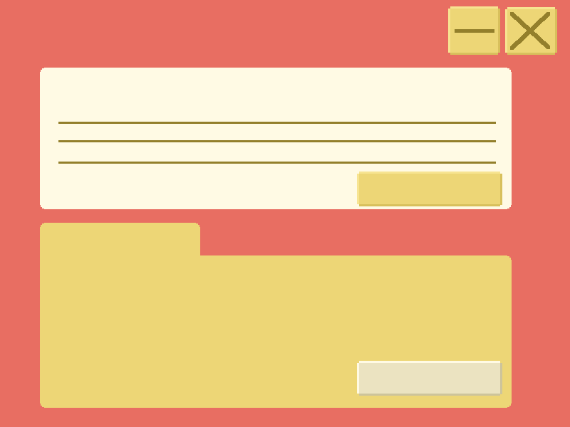

# myYoutubeFileCabinet

A place to organize my youtube subscriptions and practice my backend with electron too. I lean more towards front
end so I thought something to categorize my youtube subscriptions would be a convenient way for me to practice backend.

# Process

Make a base plate app to go more in depth on what each file is supposed to do. Comment as heavily as I can.

# Categories

These are categories I would use to categorize my own youtube channel subscriptions

## Making Games

## Funnies

## Tech Industry

## Learning about people

## Learning about institutions

## Food

## Art from a Cool Artist

## Fashion

## Animation Industry

## Travel

# Font used

https://fonts.google.com/specimen/Pixelify+Sans

# Art

## What the planned screen looks like

## Assets

This is the folder that will hold channels by category

This is the background for the add channel form (for user to add their own youtube channels)

Custom exit button

Custom minimize button

Delete button to be put inside folder. Need to figure this one out

add channel button (custom)

search button

## Hex codes

bg color: e86e62
manila folder: edd676

form: fffae4
form font color: 937f2b

folder button main bg: ebe3c1
folder button light: fffae4
folder button dark: cdc49b

# Sources

https://github.com/saleel/nymdrive
https://github.com/EshelEyni/DuckMap
https://github.com/VitaliyRubachuk/Il-Gambero-Rosso.github.io
https://github.com/AntonKhorev/osm-note-viewer

# Notes

JSON file will hold the youtube channel data- array of objects where each obj is youtube channel

## How does this work in file cabinet metaphor:

-category field inside json is the file folder
-channel is a file, each file within a folder
-UI represetation: each category/folder and channels inside get dynamically renderred.

## Note about scalability, two options in case massive data sizes, but this is for personal use so json is fine:

-lowdb (which uses JSON files but offers more robust query/update methods) or even
-sqlite3 for a more traditional relational approach. However, for most personal use cases,
a single JSON file is perfectly fine and simple.

## Note about addtional features:

-add a search/filter thing. That could filter channels by name, link or cateogry
--would still need to re-render channels based on filter criterira

-add an edit button for each channel so users can modify and save

-would need to have better error handling with user feedback: like a toast for saves that works, or errors

-add drag and drop so user can move channels between categories. would need html5 and drag and drop api

-advanced feature is youtube api integration to fetch channel details like sub count and stuff,
--would need api key and handling api requests

-add user preferences that would allow users to mess with dsiplay options like sort order and save them in separate json file
--Electron has a app.getPath('userData') for the separte json

-consider adding framework like React with electron for better UI

-Electronlifecycle makes the entry point, main start first, then creates browserwindow,that browserwindow loads index.html and renderer.js

## Issues

- ipcMain handlers need to be registered before any browser windows are loaded and try to communicate with it
  -- ipcMain handlers had to be moved before the app.WhenReady to fix that issue. This makes sure the ipcmain handlers are set up and ready before the entire app gets ready to be rendered to my understanding.

--so it was a timing issue

### The race condition

- Electron's lifecycle means that main process starts first, and then creates BrowserWindow (the createWindow part) which loads your index.html and renderer process (which allows us to see wtf is going on)

- renderer.js often starts executing code before the ipcMain.handle calls in main.js have fully registered their listeners. This includes the loadChannels at the end of the file. This creates a race condition. If the renderer tries to invoke a channel before ipcMain.handle for that channel has been called, you get this "No handler registered" error.

- how to fix this is ensure Handlers are Registered Before Window Loads

-need to guarantee that all your ipcMain.handle calls are registered before the BrowserWindow loads any content that might try to use those IPC channels.

### Exit and Minimize windows not working at first

Need to expose minimizeWindow() and exitApp() in the preload.js file for it to render correctly in the other ones like render.js or main.js

Note how contextIsolation: true in main.js helps for security reasons. It helps prevent direct access to Node.js API like ipcRenderer to communicate with main process (main.js).

So preload is basically a bridge, exposing functionalities of the APi and main process stuff.

### typeerror with the Search window button

Uncaught TypeError: Cannot read properties of null (reading 'classList')
    at HTMLButtonElement.<anonymous> (render.js:150:16)

The searchForm const is null when trying to access classList property. So the line that says document.querySelector("search-form") didn't find anything

It was a typo. I was missing a .

### The inputed channels are not persistent

The ipcMain.handle and ipcREnderer.invoke should be fine with helpign persistence.

2 potential problems. The setup I had with the one json element already in json file or a path issue with loadChannels

The one element in the json file might be messing with how save-channels works too because of how it might not add the data correctly, so i gotta empty the channels.json.

how to address unexpected paths or environment issues:
see if data file is being saved correctly in correct file.
